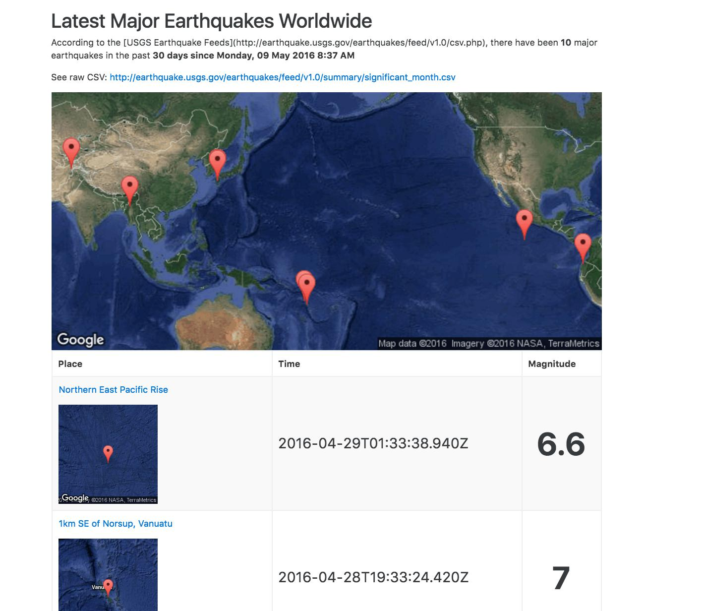

# Less Simple Flask Earthquakes app

This is a more complicated version of the Basic Heroku Flask App lesson: [https://github.com/datademofun/heroku-basic-flask](https://github.com/datademofun/heroku-basic-flask).

See this app in action: https://peaceful-sierra-25803.herokuapp.com/

Or, see the screenshot:

# About the data

Earthquake data comes from the USGS: http://earthquake.usgs.gov/earthquakes/feed/v1.0/csv.php

## How to create a URL for a Google static map

Example Google Static Map URL: 

[https://maps.googleapis.com/maps/api/staticmap?size=600x300&markers=Stanford,CA](https://maps.googleapis.com/maps/api/staticmap?size=600x300&markers=Stanford,CA)

What it looks like:

Google documentation for the static maps API: https://developers.google.com/maps/documentation/static-maps/intro#URL_Parameters

Some examples of how to use the [__urllib.parse.urlencode__ method to create complicated query strings](http://2016.compciv.org/guides/python/how-tos/creating-proper-url-query-strings/).

Try this out:

~~~py
from urllib.parse import urlencode
GMAPS_URL = 'https://maps.googleapis.com/maps/api/staticmap?'
locations = ['Stanford, CA', 'Berkeley, CA', 'Napa, CA']
myparams = {'size': '800x400', 'maptype': 'satellite', 'markers': locations}

url = GMAPS_URL + urlencode(myparams, doseq=True)
# https://maps.googleapis.com/maps/api/staticmap?size=800x400&maptype=satellite&markers=Stanford%2C+CA&markers=Berkeley%2C+CA&markers=Napa%2C+CA
~~~

Which renders this map:

